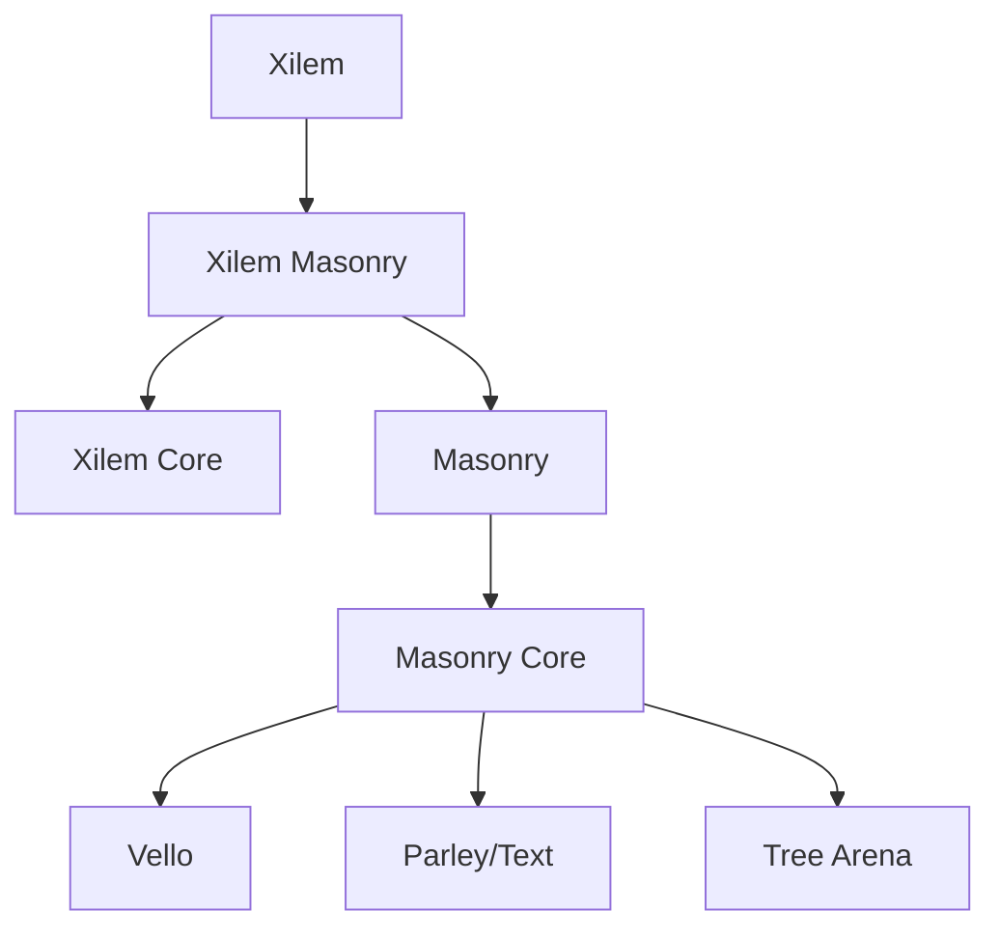

# Stylo Integration Survey for rvue

> **Authors**: Alex Crichton, Leptos Team, 尤雨溪, Ryan Carniato (平行世界協作)
> **Date**: 2026-01-21
> **Reference**: [Core Design Doc](./2026-01-17_17-30-40_Gemini_Google_Gemini.md)

## Executive Summary

This document surveys Mozilla's **Stylo CSS engine** for potential integration into **rvue**, the Rust GUI framework combining easy-oilpan GC + Vello + Taffy + Solid.js-like reactivity. We compare Stylo's approach with **xilem/Masonry**'s property system to identify the optimal styling strategy for rvue.

### Key Findings

| Aspect | Stylo | xilem/Masonry | rvue Current |
|--------|-------|---------------|--------------|
| **CSS Parsing** | Full browser-grade | None | None |
| **Selector Matching** | Complete CSS4 | None | None |
| **Property System** | ~500 CSS properties | Type-safe Property trait | Manual Style struct |
| **Cascade/Inheritance** | Full cascade algorithm | Property inheritance | None |
| **Dependencies** | Heavy (~50 crates) | Minimal | Minimal |
| **Integration Complexity** | High | Medium | Low |

**Recommendation**: Adopt a **hybrid approach** - use Stylo's `selectors` crate for selector matching while building a lightweight property system inspired by Masonry.

---

## 1. Stylo Architecture Overview

Stylo is Mozilla's production CSS engine, powering Firefox and Servo. It's a **high-performance, browser-grade** solution with several key components:

### 1.1 Crate Structure

```
stylo/
├── style/              # Main CSS engine (stylo crate)
├── selectors/          # CSS selector parsing & matching ⭐
├── style_traits/       # Types for interop without full dependency
├── stylo_dom/          # DOM abstraction traits
├── stylo_atoms/        # Interned string atoms
├── servo_arc/          # Custom Arc implementation
├── style_derive/       # Derive macros for CSS properties
└── malloc_size_of/     # Memory measurement
```

### 1.2 Core Traits

#### TNode & TElement (stylo_dom)

The fundamental abstraction for DOM integration:

```rust
/// The main trait for DOM nodes
pub trait TNode: Sized + Copy + Clone + Debug + NodeInfo + PartialEq {
    type ConcreteElement: TElement<ConcreteNode = Self>;
    type ConcreteDocument: TDocument<ConcreteNode = Self>;
    
    fn parent_node(&self) -> Option<Self>;
    fn first_child(&self) -> Option<Self>;
    fn next_sibling(&self) -> Option<Self>;
    fn as_element(&self) -> Option<Self::ConcreteElement>;
}

/// The element trait - main abstraction the style system works with
pub trait TElement: Eq + Hash + Sized + Copy + Clone + SelectorsElement {
    fn state(&self) -> ElementState;
    fn id(&self) -> Option<&WeakAtom>;
    fn each_class<F>(&self, callback: F) where F: FnMut(&AtomIdent);
    fn style_attribute(&self) -> Option<...>;
    fn borrow_data(&self) -> Option<AtomicRef<ElementData>>;
    // ... 50+ methods
}
```

#### ElementState (stylo_dom)

Comprehensive element state flags (64-bit bitfield):

```rust
pub struct ElementState: u64 {
    const ACTIVE = 1 << 0;
    const FOCUS = 1 << 1;
    const HOVER = 1 << 2;
    const ENABLED = 1 << 3;
    const DISABLED = 1 << 4;
    const CHECKED = 1 << 5;
    const FOCUS_WITHIN = 1u64 << 31;
    // ... 50+ states for :pseudo-class matching
}
```

### 1.3 Style Resolution Pipeline

```
┌─────────────────┐     ┌────────────────┐     ┌──────────────────┐
│  CSS Parsing    │────▶│ Selector       │────▶│   Cascade        │
│  (cssparser)    │     │ Matching       │     │   Resolution     │
└─────────────────┘     └────────────────┘     └──────────────────┘
                                                        │
                                                        ▼
┌─────────────────┐     ┌────────────────┐     ┌──────────────────┐
│  Layout         │◀────│ ComputedValues │◀────│  Property        │
│  (Taffy/Servo)  │     │                │     │  Cascade         │
└─────────────────┘     └────────────────┘     └──────────────────┘
```

---

## 2. Selectors Crate Analysis

The `selectors` crate is **Stylo's most valuable standalone component** for rvue integration.

### 2.1 Features

- **CSS Selector Level 4** support
- Standalone - minimal dependencies
- **Generic over DOM implementation** via `Element` trait
- High-performance matching algorithm
- Bloom filter optimization for descendant selectors

### 2.2 Usage Example

```rust
use selectors::matching::{MatchingContext, MatchingMode};
use selectors::parser::Selector;

// Parse a selector
let selector: Selector<MyImpl> = parser.parse(".button:hover")?;

// Match against element
let mut context = MatchingContext::new(
    MatchingMode::Normal,
    None,
    &mut selector_caches,
    QuirksMode::NoQuirks,
    NeedsSelectorFlags::No,
);

if matches_selector(&selector, 0, None, &element, &mut context) {
    // Apply styles
}
```

### 2.3 Required Trait Implementation

For rvue to use `selectors`, we must implement:

```rust
impl selectors::Element for RvueElement {
    type Impl = RvueSelectorImpl;
    
    fn parent_element(&self) -> Option<Self>;
    fn is_root(&self) -> bool;
    fn is_pseudo_element(&self) -> bool;
    fn has_local_name(&self, name: &LocalName) -> bool;
    fn has_class(&self, name: &AtomIdent, case_sensitivity: CaseSensitivity) -> bool;
    fn has_id(&self, name: &AtomIdent, case_sensitivity: CaseSensitivity) -> bool;
    fn attr_matches(&self, ...) -> bool;
    fn match_pseudo_element(&self, pseudo: &PseudoElement, ...) -> bool;
    // ... ~25 methods
}
```

### 2.4 Integration Cost

| Factor | Assessment |
|--------|------------|
| Dependencies | Low (cssparser, smallvec, bitflags) |
| Trait impl complexity | Medium (~25 methods) |
| Memory overhead | Low (no runtime allocation) |
| Performance | Excellent (browser-grade) |

---

## 3. xilem/Masonry Property System Analysis

xilem/Masonry uses a **type-safe, compile-time property system** fundamentally different from CSS.

### 3.1 Property Trait

```rust
/// A widget property - type-safe, with static defaults
pub trait Property: Default + Send + Sync + 'static {
    /// Static reference to default value for zero-allocation access
    fn static_default() -> &'static Self;
}

/// Marker trait - which widgets can have which properties
pub trait HasProperty<P: Property>: Widget {}
```

### 3.2 Dimensions Example

```rust
#[derive(Copy, Clone, Debug, Default, PartialEq)]
pub struct Dimensions {
    width: Dim,
    height: Dim,
}

pub enum Dim {
    Auto,           // Container decides
    Fixed(Length),  // Exact pixels
    Ratio(f64),     // Percentage of parent
    Stretch,        // Fill available space
    MinContent,     // Fit minimum content
    MaxContent,     // Fit maximum content
    FitContent,     // Fit into context
}

// Every widget has dimensions
impl<W: Widget> HasProperty<Dimensions> for W {}
```

### 3.3 Property Access

```rust
// Read property (returns &T, never Option)
let dims = widget_ref.get_prop::<Dimensions>();

// Check local presence
if widget_ref.contains_prop::<Dimensions>() { ... }

// Properties container
pub struct Properties {
    map: AnyMap,           // Local properties
    default_map: &'static DefaultProperties,  // Fallbacks
}
```

### 3.4 Comparison with Stylo

| Aspect | Stylo | Masonry |
|--------|-------|---------|
| Type safety | Runtime (CSS strings) | Compile-time |
| Selector support | Full CSS | None (direct assignment) |
| Default values | Per-property cascade | Static defaults |
| Inheritance | CSS cascade | Explicit |
| Hot reload | Possible | Requires recompile |
| External stylesheets | Yes | No |
| Bundle size impact | Heavy | Minimal |

---

## 4. rvue Current Styling

### 4.1 Current Implementation

```rust
// crates/rvue/src/style.rs
pub struct Style {
    pub color: Option<Color>,
    pub background_color: Option<Color>,
    pub font_size: Option<f32>,
    pub font_weight: Option<FontWeight>,
    pub padding: Option<Spacing>,
    pub margin: Option<Spacing>,
    pub border: Option<Border>,
    pub border_radius: Option<f32>,
    pub width: Option<Size>,
    pub height: Option<Size>,
    pub flex_direction: Option<FlexDirection>,
    pub gap: Option<f32>,
    // ... more properties
}
```

### 4.2 Limitations

1. **No selector matching** - styles must be explicitly assigned
2. **No cascade** - no inheritance or specificity
3. **No dynamic pseudo-classes** - no `:hover`, `:focus`, etc.
4. **No external stylesheets** - inline only

---

## 5. Integration Strategies

### Strategy A: Full Stylo Integration

**Approach**: Use complete `stylo` crate for CSS parsing, matching, and cascade.

```rust
// Example usage
let stylist = Stylist::new();
stylist.add_stylesheet(css!("
    .button { background: blue; }
    .button:hover { background: lightblue; }
"));

// Per-element styling
let computed = stylist.resolve_style(element, &context);
```

**Pros**:
- Full CSS support
- Battle-tested (Firefox/Servo)
- Hot-reloadable stylesheets

**Cons**:
- ~50 crate dependencies
- Complex TElement implementation (~50 methods)
- Overkill for many desktop apps
- Compilation time increase

**Effort**: ~4-6 weeks

### Strategy B: Selectors-Only Integration

**Approach**: Use only the `selectors` crate for matching, custom property system.

```rust
// Selector matching for pseudo-states
impl RvueWidget {
    fn matches(&self, selector: &str) -> bool {
        let parsed = parse_selector(selector)?;
        matches_selector(&parsed, &self.as_element(), &mut ctx)
    }
}

// Style application with pseudo-state support
fn apply_styles(&self) {
    let base = self.style.clone();
    if self.matches(":hover") {
        base.merge(self.hover_style);
    }
}
```

**Pros**:
- Minimal dependencies
- Standard CSS selector syntax
- Pseudo-class support (`:hover`, `:focus`, etc.)
- Reasonable implementation effort

**Cons**:
- No full cascade
- Limited to selector matching
- Custom property resolution needed

**Effort**: ~2-3 weeks

### Strategy C: Masonry-Inspired Type-Safe Properties

**Approach**: Build a property system inspired by Masonry's design.

```rust
// Define properties
#[derive(Property)]
pub struct BackgroundColor(Color);

#[derive(Property)]
pub struct Padding(Spacing);

// Widget usage
let button = Button::new("Click")
    .with_prop(BackgroundColor(Color::Blue))
    .with_prop(Padding(Spacing::uniform(8.0)));

// Access in paint
fn paint(&self, ctx: &mut PaintCtx, props: &Properties) {
    let bg = props.get::<BackgroundColor>();
    ctx.fill(self.bounds, bg.0);
}
```

**Pros**:
- Full type safety
- IDE autocomplete
- No runtime overhead
- Clean API

**Cons**:
- No CSS familiarity
- No external styling
- More verbose for complex styling

**Effort**: ~2 weeks

### Strategy D: Hybrid (Recommended)

**Approach**: Combine `selectors` crate with Masonry-style type-safe properties.

```rust
// Type-safe base styling
pub struct WidgetStyle {
    pub props: Properties,          // Type-safe properties
    pub selectors: Vec<StyleRule>,  // CSS selector rules
}

pub struct StyleRule {
    pub selector: Selector<RvueImpl>,
    pub declarations: Properties,
}

// Signal-integrated styling
view! {
    <Button 
        class="primary"
        style:background={move || if hovered() { Color::LightBlue } else { Color::Blue }}
    />
}

// External stylesheet support
stylesheet! {
    ".primary" { background: blue; padding: 8px; }
    ".primary:hover" { background: lightblue; }
}
```

**Pros**:
- Best of both worlds
- CSS selectors for pseudo-states
- Type-safe for complex styling
- Signal integration for reactivity
- Aligns with rvue's Solid.js philosophy

**Cons**:
- More complex implementation
- Two mental models

**Effort**: ~3-4 weeks

---

## 6. GC Integration Analysis

### 6.1 easy-oilpan Compatibility

Both Stylo and Masonry use `Arc` for style sharing. For rvue with easy-oilpan:

```rust
// Current Stylo approach
pub struct ElementData {
    styles: Arc<ComputedValues>,  // Reference counted
}

// rvue with easy-oilpan
pub struct ElementData {
    styles: Gc<ComputedValues>,  // GC managed
}
```

**Considerations**:
- Stylo's `servo_arc` could be replaced with `Gc<T>`
- StyleRule nodes benefit from GC (selector graphs can be cyclic)
- No `Weak<T>` needed for style parent references

### 6.2 Signal Integration

Rvue's Solid.js-like reactivity integrates well with both approaches:

```rust
// Reactive styling with GC
#[derive(Trace)]
struct StyledWidget {
    base_style: Signal<Properties>,
    computed_style: Memo<Properties>,
}

impl StyledWidget {
    fn new() -> Gc<Self> {
        let base_style = create_signal(Properties::default());
        let computed_style = create_memo(move |_| {
            let mut style = base_style.get();
            if self.is_hovered() {
                style.merge(self.hover_style());
            }
            style
        });
        
        Gc::new(Self { base_style, computed_style })
    }
}
```

---

## 7. Recommended Implementation Plan

### Phase 1: selectors Integration (Week 1-2)

1. Add `selectors` dependency
2. Implement `RvueSelectorImpl` for selector types
3. Implement `Element` trait for rvue widgets
4. Create `ElementState` tracking for `:hover`, `:focus`, etc.
5. Build `SelectorMatcher` utility

### Phase 2: Property System (Week 2-3)

1. Port Masonry's `Property` trait
2. Implement core properties (Color, Spacing, Dim, etc.)
3. Create `Properties` container with GC support
4. Add `#[derive(Property)]` macro
5. Integrate with widget paint/layout

### Phase 3: Stylesheet Support (Week 3-4)

1. Create `stylesheet!` macro for CSS-like syntax
2. Build style rule compilation
3. Implement specificity-based cascade (simplified)
4. Add hot-reload for development

### Phase 4: Signal Integration (Week 4)

1. Reactive style properties
2. Derived style computations
3. Transition/animation hooks

---

## 8. API Design Sketch

### 8.1 Core Types

```rust
// Selector integration
pub struct RvueElement<'a> {
    widget: &'a dyn Widget,
    state: ElementState,
    parent: Option<&'a RvueElement<'a>>,
}

impl<'a> selectors::Element for RvueElement<'a> { ... }

// Properties
pub trait StyleProperty: Property {
    fn from_css_value(value: &CssValue) -> Option<Self>;
    fn to_taffy(&self) -> Option<taffy::style::Style>;
}

// Style resolution
pub struct StyleResolver {
    rules: Vec<StyleRule>,
    selector_caches: SelectorCaches,
}

impl StyleResolver {
    pub fn resolve(&self, element: &RvueElement) -> Properties {
        let mut props = Properties::default();
        for rule in &self.rules {
            if rule.matches(element, &mut self.selector_caches) {
                props.merge(&rule.properties);
            }
        }
        props
    }
}
```

### 8.2 Usage in Components

```rust
#[component]
fn Button(children: Children) -> impl Widget {
    let (hovered, set_hovered) = create_signal(false);
    
    view! {
        <Box
            class="button"
            on:pointer_enter={move |_| set_hovered(true)}
            on:pointer_leave={move |_| set_hovered(false)}
            // Reactive styling
            prop:background={move || if hovered() { 
                Color::rgb(100, 149, 237) 
            } else { 
                Color::rgb(65, 105, 225) 
            }}
            prop:padding={Spacing::symmetric(8.0, 16.0)}
        >
            {children}
        </Box>
    }
}

// Optional: CSS-like stylesheet
stylesheet! {
    ".button" {
        border_radius: 4.0;
        font_weight: bold;
    }
    ".button:active" {
        transform: scale(0.98);
    }
}
```

---

## 9. Conclusion

### Summary of Recommendations

1. **Use `selectors` crate** for CSS selector parsing and matching
   - Provides `:hover`, `:focus`, `:active` support
   - Standard syntax familiar to web developers
   - Minimal dependencies

2. **Build type-safe property system** inspired by Masonry
   - Compile-time type safety
   - IDE integration
   - GC-friendly design

3. **Create hybrid styling API** combining both approaches
   - CSS selectors for state-based styling
   - Type-safe properties for programmatic control
   - Signal integration for reactive updates

4. **Defer full Stylo integration** until proven necessary
   - Desktop apps rarely need full CSS cascade
   - Focus on 80/20 - common styling patterns
   - Can add later if demand emerges

### Integration Difficulty Assessment

| Component | Difficulty | Value | Priority |
|-----------|------------|-------|----------|
| `selectors` crate | Medium | High | **P0** |
| Property trait system | Low | High | **P0** |
| ElementState tracking | Low | High | **P0** |
| Stylesheet macro | Medium | Medium | P1 |
| Hot reload | High | Medium | P2 |
| Full Stylo cascade | Very High | Low | P3 |

### Next Steps

1. Create `rvue-style` crate with Property trait
2. Implement RvueSelectorImpl and Element trait
3. Build ElementState tracking integrated with event system
4. Design stylesheet! macro syntax
5. Prototype reactive style bindings

---

## Appendix A: Dependency Analysis

### selectors crate dependencies
```toml
bitflags = "2"
cssparser = "0.36"
derive_more = { version = "2", features = ["add", "add_assign"] }
log = "0.4"
phf = "0.13"
smallvec = "1.0"
servo_arc = { workspace = true }  # Could use Gc instead
```

### Full stylo dependencies (excerpt)
```toml
app_units, arrayvec, atomic_refcell, bitflags, byteorder,
cssparser, derive_more, euclid, indexmap, itertools, log,
malloc_size_of, num_cpus, num-traits, parking_lot, rayon,
selectors, serde, smallvec, static_assertions, thin-vec, ...
# ~50 total dependencies
```

## Appendix B: xilem Architecture Reference



## Appendix C: Related Documents

- [Core Design Doc](./2026-01-17_17-30-40_Gemini_Google_Gemini.md)
- [Event System Plan](./event-system-plan-1.md)
- [Vello Integration Plan](./vello-plan-1.md)
- [Text Rendering Plan](./render-text-plan-1.md)
